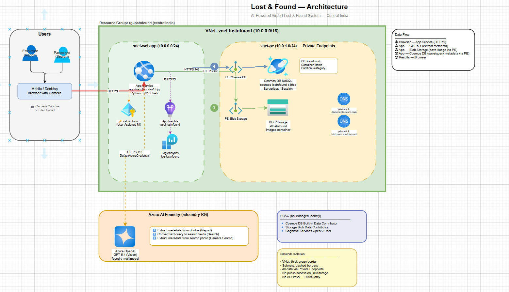

# 📦 Lost & Found

[Python 3.12](https://www.python.org/) [Flask](https://flask.palletsprojects.com/) [Azure OpenAI](https://azure.microsoft.com/products/ai-services/openai-service) [License: MIT](LICENSE) [Deploy: Azure App Service](https://app-lostnfound-s1thjq.azurewebsites.net)

Created by [vinayjain@microsoft.com](mailto:vinayjain@microsoft.com) / [vinex22@gmail.com](mailto:vinex22@gmail.com)

**AI-Powered Airport Lost & Found** — employees report found items by snapping a photo; GPT-5.4 extracts rich metadata automatically. Passengers search by text (any language) or by uploading a photo of their lost item. Built with Flask, Cosmos DB, Blob Storage, and `DefaultAzureCredential` (no API keys 🔑).

> **Live instance:** [https://app-lostnfound-s1thjq.azurewebsites.net](https://app-lostnfound-s1thjq.azurewebsites.net)

---

## 📑 Table of Contents

- [Overview](#-overview)
- [Features](#-features)
- [Prerequisites](#-prerequisites)
- [Project Structure](#-project-structure)
- [Configuration](#-configuration)
- [Local Development](#-local-development)
- [API Endpoints](#-api-endpoints)
- [Architecture](#-architecture)
- [Deployment](#-deployment)
- [Troubleshooting](#-troubleshooting)
- [License](#-license)

---

## 🔎 Overview

1. **Report** — Employee uploads up to 3 photos + free-text location → GPT-5.4 extracts structured metadata (category, brand, color, size, condition, distinguishing features)
2. **Search (Text)** — Type a natural language query in any language → GPT converts to structured fields → OR-based Cosmos DB query with relevance ranking
3. **Search (Camera)** — Upload/snap a photo of your lost item → GPT extracts metadata → matches against the database
4. **Dashboard** — Browse recently found items with click-to-expand detail modal

---

## ✈️ Features

- **AI Vision Metadata Extraction (v1.1)** — GPT-5.4 reads brand, color, text, OCR, distinguishing marks across up to 3 photos in a single consolidated pass; emits `colors[]`, `ocr_text`, and `confidence`
- **Hybrid Vector + Keyword Search** — Cosmos DB diskANN vector index (1536-dim, cosine) blended with brand/OCR keyword boosts and a relative cutoff to suppress semantic-neighbor noise
- **Multi-language Search** — query in English, Hindi, Chinese, Japanese, etc. (LLM normalizes to English fields before vectorization)
- **Camera Capture** — mobile-first with `capture="environment"` for rear camera
- **Photo Search** — find items by uploading a similar photo (re-uses the same extractor)
- **Up to 3 photos per item** — GPT can request more if quality is insufficient
- **Private Endpoints** — Cosmos DB and Storage accessible only via VNet
- **Managed Identity** — zero API keys, zero SAS tokens, zero passwords
- **Application Insights** — OpenTelemetry instrumentation with Live Metrics
- **Mobile-first responsive UI** — clean minimal design inspired by modern web apps

---

## ✅ Prerequisites

1. Python 3.12+
2. Azure AI Services account with GPT-5.4 deployment (vision-capable)
3. Azure Cosmos DB NoSQL (Serverless)
4. Azure Blob Storage account
5. `Cognitive Services OpenAI User` role for your identity
6. `az login` completed (for local dev)

---

## 📁 Project Structure

```
lostnfound/
├── src/
│   ├── app.py                    # Flask application + API routes
│   ├── config.py                 # Configuration from environment
│   ├── __init__.py
│   ├── services/
│   │   ├── ai_service.py         # GPT-5.4 metadata extraction + search
│   │   ├── cosmos_service.py     # Cosmos DB CRUD + hybrid vector search
│   │   └── storage_service.py    # Blob Storage upload/download
│   ├── templates/
│   │   ├── base.html             # Base template (nav, branding)
│   │   ├── index.html            # Dashboard (recent items feed)
│   │   ├── report.html           # Report found item page
│   │   └── search.html           # Search page (text + camera tabs)
│   └── static/
│       ├── css/style.css         # Custom CSS (no Bootstrap)
│       └── js/
│           ├── report.js         # Report page logic
│           └── search.js         # Search page logic
├── scripts/                      # One-off + ops scripts (not deployed)
│   ├── explain_search.py         # 8-step verbose trace of the search pipeline
│   ├── debug_search.py           # Parsed fields + raw vector hits + final ranking
│   ├── eval_search.py            # ~30 curated queries vs. live API (OK/NOISY/MISS)
│   ├── bulk_ingest.py            # Posts random LoremFlickr images to /api/report
│   ├── raw_sim.py                # Raw vector neighbours (bypasses hybrid logic)
│   ├── reextract_v2.py           # Re-run latest GPT prompt over existing items
│   ├── backfill_v2.py            # Backfill embeddings/fields into items_v2
│   ├── compare_metadata.py       # Diff old vs. new extraction side-by-side
│   ├── show_latest.py            # Inspect most-recently ingested items
│   ├── check_ocr.py              # Quick OCR-text inspector
│   ├── debug_hybrid.py           # Hybrid score breakdown helper
│   └── create_vector_container*  # One-time creators for items_v2 (py / arm / ps1)
├── inspect_db.py                 # Top-level DB inspector
├── migrate_thumbs.py             # One-time blob thumbnail migration
├── docs/
│   ├── architecture.drawio       # Editable draw.io diagram
│   ├── architecture.png          # Rendered diagram
│   └── DEPLOYMENT.md             # Azure deployment guide
├── wiki/                         # Agent knowledge base (gitignored)
├── .azure/
│   └── deployment-plan.md        # Azure deployment plan
├── .env.example                  # Environment variable template
├── .gitignore
├── LICENSE
├── README.md
├── requirements.txt
└── startup.sh                    # Gunicorn startup command
```

---

## ⚙️ Configuration

Copy `.env.example` to `.env` and fill in:

```bash
cp .env.example .env
```

| Variable | Required | Description |
|----------|----------|-------------|
| `AZURE_AI_SERVICES_ENDPOINT` | Yes | Azure AI Foundry endpoint URL |
| `AZURE_OPENAI_DEPLOYMENT` | No | Model deployment name (default: `gpt-5.4`) |
| `COSMOS_ENDPOINT` | Yes | Cosmos DB endpoint URL |
| `COSMOS_DATABASE` | No | Database name (default: `lostnfound`) |
| `COSMOS_CONTAINER` | No | Container name (default: `items`) |
| `AZURE_STORAGE_ACCOUNT_URL` | Yes | Blob Storage endpoint URL |
| `STORAGE_CONTAINER` | No | Blob container name (default: `images`) |
| `AZURE_CLIENT_ID` | No | Managed identity client ID (for App Service) |
| `DEBUG` | No | Enable debug logging (`true`/`false`) |

---

## 🚀 Local Development

```bash
# Clone the repo
git clone https://github.com/vinex22/lostnfound.git
cd lostnfound

# Create virtual environment
python -m venv .venv
.venv\Scripts\Activate.ps1  # Windows PowerShell
# source .venv/bin/activate  # Linux/macOS

# Install dependencies
pip install -r requirements.txt

# Copy and configure environment
cp .env.example .env
# Edit .env with your Azure resource values

# Run the app
python -m flask --app src.app run --host 0.0.0.0 --port 8000 --debug
```

Open [http://localhost:8000](http://localhost:8000) in your browser.

---

## 🔌 API Endpoints

| Method | Path | Description |
|--------|------|-------------|
| `GET` | `/` | Dashboard — recent items feed |
| `GET` | `/report` | Report found item page |
| `GET` | `/search` | Search page (text + camera) |
| `POST` | `/api/report` | Submit found item (multipart: images + location) |
| `POST` | `/api/search/text` | Natural language text search |
| `POST` | `/api/search/image` | Photo-based search |
| `GET` | `/api/items/recent` | Get recent items JSON |
| `GET` | `/images/<path>` | Image proxy (storage behind PE) |

---

## 🧠 Architecture



> Edit the diagram: open [docs/architecture.drawio](docs/architecture.drawio) in [draw.io](https://app.diagrams.net/) or VS Code.

**Flow:**

1. Employee/passenger accesses the web app via browser (mobile camera or desktop)
2. **Report**: Photos sent to GPT-5.4 → extracts structured metadata → images stored in Blob Storage → metadata saved to Cosmos DB
3. **Search (Text)**: GPT-5.4 converts natural language to query fields → Cosmos DB OR-query with relevance ranking
4. **Search (Camera)**: GPT-5.4 extracts metadata from search photo → matches against DB

**Azure Resources (Central India):**

| Resource | Name | Purpose |
|----------|------|---------|
| Resource Group | `rg-lostnfound` | All resources |
| App Service | `app-lostnfound-s1thjq` | Flask web app (B1 Linux) |
| Cosmos DB | `cosmos-lostnfound-s1thjq` | NoSQL metadata store (Serverless) |
| Storage | `stlostnfound` | Blob storage for images |
| Managed Identity | `id-lostnfound` | Passwordless auth to all services |
| VNet | `vnet-lostnfound` | Network isolation |
| Private Endpoints | PE for Cosmos DB + Storage | No public access |
| App Insights | `appi-lostnfound` | Monitoring + Live Metrics |
| Log Analytics | `log-lostnfound` | Centralized logging |
| Azure OpenAI | `foundry-multimodel` / `gpt-5.4` | Vision model (in `aifoundry` RG) |

**Security:**
- No API keys, SAS tokens, or passwords — all auth via `DefaultAzureCredential` + managed identity
- Cosmos DB and Storage behind Private Endpoints (public access disabled)
- App Service VNet-integrated to reach PEs

---

## 🏆 Tech Achievements

Things we built beyond the baseline CRUD app:

### 1. Hybrid Vector + Keyword Search (Cosmos DB diskANN) — v1.2
- New container `items_v2` with a **diskANN vector index** on `/embedding` (1536-dim cosine) — Azure Cosmos DB's newest vector backend, built for sub-100ms ANN at scale.
- Each item embeds a *concatenated text profile* (name + brand + colors + OCR + features) using `text-embedding-3-small`.
- Query path:
  1. LLM converts free-text/photo into a structured field set (any language → English).
  2. The query embedding text is **enriched** by concatenating `query_text + item_name + brand + color + top-5 keywords` so single-word queries (e.g. `phone`, `alcohol`) get a stronger semantic signal.
  3. Cosmos returns the top-K nearest neighbors via `VectorDistance(c.embedding, @qv)`.
  4. A second pass adds a **keyword score** with strong weights for brand match (+10), brand-in-OCR (+8), and OCR keyword hits (+4).
  5. A **two-tier similarity floor** decides what survives:
     - If anything is ≥ 0.35 hard floor → keep it plus any neighbor within 0.15 similarity of the top match (rescues e.g. iPhone @0.34 alongside Smartphone @0.48).
     - If nothing clears 0.35 → soft floor of 0.20 + tight 95%-of-top relative cutoff (stops generic queries like `alcohol` from dragging in every food/drink item).
  6. **No keyword-search fallback when the vector query returns nothing** — empty result is honest; OR-style keyword fallback used to flood generic queries with noise.
- Fallback: if the vector index is missing entirely, the service degrades to pure keyword search.

### 2. Multi-Image Consolidation Prompt (v1.1)
- One GPT-5.4 call takes **up to 3 photos** and returns a single merged JSON record — no per-image post-processing.
- Schema includes `colors[]` (sorted by dominance), `ocr_text` (verbatim only — explicit anti-hallucination instruction in v1.1), `distinguishing_features`, `confidence`.
- Versioned prompt with footer marker (`v1.1`) so we can A/B prompt iterations against the same image set.

### 3. Reproducible Re-Extraction Pipeline
- `scripts/reextract_v2.py` re-runs the latest prompt on every existing item's stored blobs and writes the result back to `items_v2`, preserving the original `id` and `created_at`.
- Lets us *upgrade prompt + schema* without losing data or re-uploading photos. Used to migrate 14 production items from v1.0 → v1.1 in place.

### 3a. Search Quality Tooling (v1.2)
- `scripts/eval_search.py` — runs ~30 curated queries against the live `/api/search/text` endpoint and prints an OK/NOISY/MISS/N/A status table. One-shot regression check after any search-tier change.
- `scripts/debug_search.py <query>` — prints the parsed LLM fields, the embedding text, all candidates *before* the cutoff, and the final ranked result. Indispensable for diagnosing "why didn't X show up" issues.
- `scripts/explain_search.py <query>` — verbose 8-step "explain like I'm 5" trace of the production pipeline (LLM parse → embed text → vector → Cosmos KNN → two-tier sim floor → hybrid score → three-regime cutoff → final results). Uses the real `src.app` and `src.services.cosmos_service` modules so what you see is what runs in prod.
- `scripts/bulk_ingest.py` — posts random LoremFlickr images to `/api/report` to grow the corpus during eval. Honors the `needs_more_images` signal.

### 4. Passwordless Everything
- `DefaultAzureCredential` end-to-end — Cosmos DB, Blob Storage, Azure OpenAI, App Insights.
- App Service uses a **user-assigned managed identity**; storage account has **shared-key disabled** (subscription policy).
- Function-app-style storage connection avoided in favor of MI-based blob client.

### 5. Network Isolation
- Cosmos DB and Storage are reachable **only via Private Endpoints** in `vnet-lostnfound`.
- App Service is VNet-integrated; public access is disabled on data plane resources.
- Image serving goes through an authenticated `/images/<path>` proxy in Flask so the storage account never needs public/anonymous access.

### 6. Observability
- OpenTelemetry auto-instrumentation → Application Insights with Live Metrics.
- Every search logs the parsed fields, vector hit count, and final hybrid scores — makes the debug scripts (`scripts/debug_search.py`, `scripts/raw_sim.py`) trivial to use.

### 7. Debug & Ops Tooling
- `scripts/debug_search.py` — replays the full search flow end-to-end against prod Cosmos and prints sim + hybrid score per candidate.
- `scripts/raw_sim.py` — bypasses hybrid logic, lists raw vector neighbors. Used to pinpoint scoring bugs.
- `scripts/compare_metadata.py` — diffs old vs. new extractions side-by-side; used to validate prompt upgrades.
- `scripts/show_latest.py`, `scripts/check_ocr.py` — quick inspection helpers.

---

## ☁️ Deployment

See [docs/DEPLOYMENT.md](docs/DEPLOYMENT.md) for full Azure deployment instructions.

```powershell
# Quick deploy
az webapp up --resource-group rg-lostnfound --name app-lostnfound-s1thjq --runtime "PYTHON:3.12"
```

---

## 🛠️ Troubleshooting

| Problem | Solution |
|---------|----------|
| 401/403 from Azure AI | Ensure `Cognitive Services OpenAI User` role on AI Services account |
| Cosmos DB Forbidden | Assign `Cosmos DB Built-in Data Contributor` (RBAC, not ARM role) |
| Blob upload fails | Verify MI has `Storage Blob Data Contributor` on storage account |
| 503 after deploy | Check logs: `az webapp log tail --name app-lostnfound-s1thjq -g rg-lostnfound` |
| `max_tokens` error | GPT-5.4 requires `max_completion_tokens` (not `max_tokens`) |
| Camera not working | Camera access requires HTTPS; `.azurewebsites.net` provides this |
| ModuleNotFoundError | Set `SCM_DO_BUILD_DURING_DEPLOYMENT=true` in app settings |

---

## 📜 License

MIT — see [LICENSE](LICENSE) for details.

---

## 🤝 Contributing

Contributions welcome! Please open an issue first to discuss what you'd like to change.

---

Built with ❤️ using Azure AI Services · [Live Demo](https://app-lostnfound-s1thjq.azurewebsites.net)

**Keywords:** lost and found AI, airport lost property, Azure OpenAI GPT-5.4 multimodal, Cosmos DB NoSQL, image metadata extraction, Flask camera app, managed identity, private endpoints
